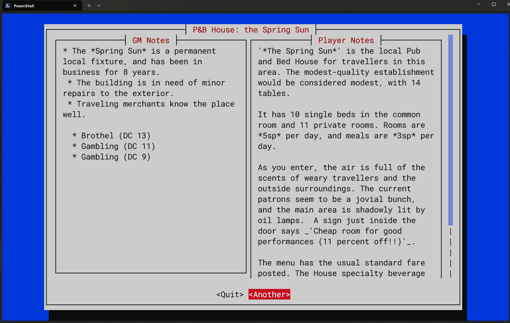
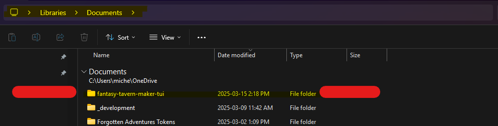

# Fantasy Tavern Maker
***For Fantasy Worlds Settings such as Dungeons & Dragons 5th Edition***

## Current Version
0.8.0-96

## Purpose
Most Games Masters or Authors are aware that they need to unique and
interesting Pubs, Taverns, Inns, Wayhouses and the like as part of the
adventure-travel narrative. However, it can be awkward to do so easily
on-the-fly without complex table rolling that interrupts the flow of the story.

This application is a RUST re-write of an original C# implementation
that I wrote which I was never happy with. So far, this version is much
more what I was hoping to achieve.

## Sample Output

# user requirements
Ensure that you have a folder called "fantasy-tavern-maker-tui" in your "Documents" folder.
This is where you will have to unzip the provided PSV data tables.

# libraries in use

https://rust-random.github.io/book/quick-start.html -- RAND functions

https://docs.rs/cursive/0.21.1/cursive/ -- cursive
